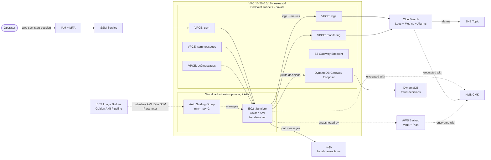

# fraud-detection-aws-platform

A production-grade fraud detection platform built on AWS, running a real-time fraud transaction scoring worker in private EC2 subnets with no public SSH, no bastion hosts, and no key pairs. Operator access is exclusively through SSM Session Manager over VPC Interface Endpoints. The fraud worker reads transactions from SQS, applies scoring rules, and persists decisions to DynamoDB — running on hardened Golden AMIs produced by EC2 Image Builder, encrypted with a customer-managed KMS key, monitored with the CloudWatch Agent, and protected by AWS Backup.

Designed as a production-pattern reference for financial workloads requiring strict isolation and auditability. Targets under $100/month in `us-east-1`.

---

## Why this exists

Most public examples for "EC2 on AWS" still teach SSH key pairs, public bastions, and `0.0.0.0/0` security group rules. That pattern carries operational debt — key rotation, audit gaps, brute-force exposure, bastion sprawl — that doesn't belong in a 2026 environment. This project demonstrates the alternative as it is actually built in well-run AWS shops:

- No inbound network access to workload instances.
- Identity-based access through IAM and SSM, fully audited, encrypted, MFA-gated.
- Immutable infrastructure via Golden AMIs and Launch Templates.
- Self-healing through an Auto Scaling Group sized at `min=max=2`.
- Encryption everywhere with a customer-managed KMS key.
- Backups with cold-storage lifecycle and a documented restore drill.
- Cost held under $100/month through deliberate trade-offs (no NAT Gateway, single CMK, Graviton compute).

The platform runs a fraud transaction scoring worker — a Python service that polls an SQS queue, evaluates transaction risk, and writes fraud decisions to DynamoDB — giving the runbooks, alarms, and automation something real to operate on.

---

## Architecture



A higher-fidelity network and IAM diagram lives in [`docs/diagrams/`](docs/diagrams/). Full architecture detail is in [`docs/architecture.md`](docs/architecture.md).

---

## What this platform does

| Capability | How |
|---|---|
| Operator shell access | SSM Session Manager over VPC Interface Endpoints, MFA-required, fully logged to CloudWatch |
| Ad-hoc and scheduled operations | SSM Run Command with versioned documents |
| Configuration management | SSM Parameter Store (Standard tier, SecureString where needed) |
| Patching | Immutable — OS patches baked into Golden AMIs via EC2 Image Builder; running instances replaced via ASG refresh, never patched in place |
| Observability | CloudWatch Agent (system + custom metrics), CloudWatch Logs, alarms on CPU/memory/disk/status, dashboard |
| Alerting | CloudWatch Alarms + EventBridge → SNS → email; events: EC2 state change, SSM Run Command failure, Backup job failure, KMS key deletion, break-glass role assumption (Slack/PagerDuty deferred) |
| Backup and recovery | AWS Backup, daily snapshots, 7d warm + 30d cold, KMS-encrypted vault |
| Fraud transaction processing | SQS queue → EC2 fraud-worker (Python) → DynamoDB; zero-downtime ASG rolling updates |
| Poison-message handling | SQS Dead Letter Queue — messages failing 3× (DynamoDB write errors) are moved to DLQ automatically; CloudWatch alarm fires when DLQ depth > 0 |
| Immutable infrastructure | EC2 Image Builder produces Golden AL2023 arm64 AMIs; Launch Template references the AMI ID via SSM Parameter |
| Self-healing | Auto Scaling Group `min=max=2` across two AZs replaces failed instances automatically |
| Encryption | Customer-managed KMS key for EBS, CloudWatch Logs, AWS Backup vault, SSM session logs |

---

## Cost summary

| Item | Estimate (monthly, us-east-1) |
|---|---|
| 2 × `t4g.micro` EC2 (730h, on-demand) | ~$12.00 |
| 2 × EBS gp3 30 GB encrypted | ~$4.80 |
| 5 × VPC Interface Endpoints | ~$36.50 |
| CloudWatch Logs (1 GB ingest, 7-day retention) | ~$0.55 |
| CloudWatch metrics + alarms | ~$1–2 |
| CloudWatch Dashboard (×1) | ~$3.00 |
| AWS Backup (~60 GB warm + cold) | ~$4–6 |
| KMS CMK | ~$1.00 |
| EC2 Image Builder (~1 build/month, t3.medium minutes) | <$1.00 |
| SQS (low volume) | ~$0 |
| DynamoDB (on-demand, low volume) | ~$0 |
| SNS (email, low volume) | ~$0 |
| **Total** | **~$65–72/month** |

Detailed cost model and the avoided-cost decisions are in [`docs/cost-model.md`](docs/cost-model.md).

The single largest line item is VPC Interface Endpoints. Forgetting to destroy the environment is the failure mode; an AWS Budgets alert at 50% / 80% / 100% of the $100 ceiling is part of the deploy.

---

## Repository layout

```
.
├── README.md                       # This file
├── LICENSE
├── Makefile                        # make validate / plan / apply / destroy
├── .github/workflows/              # CI: terraform fmt, validate, tflint, checkov
├── terraform/
│   ├── envs/dev/                   # Environment composition root
│   └── modules/                    # vpc, vpc-endpoints, kms, iam-roles,
│                                   # ec2-workload, worker-infra,
│                                   # image-builder, observability, backup
├── docs/
│   ├── architecture.md             # Full design document
│   ├── cost-model.md
│   ├── security-baseline.md
│   ├── threat-model.md
│   ├── decision-records/           # ADRs
│   └── diagrams/                   # Mermaid + PlantUML sources
├── runbooks/                       # Operational procedures
├── scripts/                        # Bootstrap configs, validation
└── assets/screenshots/             # Console screenshots for docs
```

Naming convention: `<project>-<env>-<resource>-<purpose>` (e.g., `cloudops-dev-sg-workload`, `cloudops-dev-vpce-ssm`). Required tags on every taggable resource: `Project`, `Environment`, `Owner`, `CostCenter`, `ManagedBy`, plus `Backup` and `Patch` where applicable.

---

## Documentation

The repository's documentation is structured for two audiences: a quick recruiter pass (this README + the architecture overview), and a deep technical review (the rest).

| Document | Purpose |
|---|---|
| [`docs/architecture.md`](docs/architecture.md) | Full design — networking, compute, IAM, observability, backup, AMI strategy, known gaps |
| [`docs/cost-model.md`](docs/cost-model.md) | Detailed cost breakdown, drivers, services intentionally avoided, budget guardrails |
| [`docs/security-baseline.md`](docs/security-baseline.md) | Consolidated security controls mapped to AWS Well-Architected and CIS Foundations |
| [`docs/threat-model.md`](docs/threat-model.md) | STRIDE-aligned threat enumeration, residual risks, scope gaps |
| [`docs/backup-strategy.md`](docs/backup-strategy.md) | Backup plan, vault protection, Vault Lock evaluation, recovery analysis |
| [`docs/naming-conventions.md`](docs/naming-conventions.md) | Resource naming standard with type abbreviations and special cases |
| [`docs/tagging-strategy.md`](docs/tagging-strategy.md) | Required + functional tags, IAM tag conditions, Terraform `default_tags` |
| [`docs/decision-records/`](docs/decision-records/) | ADRs — the non-obvious choices and why |
| [`docs/diagrams/`](docs/diagrams/) | Mermaid + PlantUML source for architecture, network, data-flow, IAM-trust diagrams |

---

## Architecture decisions

The non-obvious choices are documented as ADRs in [`docs/decision-records/`](docs/decision-records/):

1. [No NAT Gateway in MVP](docs/decision-records/0001-no-nat-gateway.md)
2. [SSM-only access — no SSH, no bastion](docs/decision-records/0002-ssm-only-access.md)
3. [Amazon Linux 2023 on Graviton (`arm64`)](docs/decision-records/0003-amazon-linux-2023-on-graviton.md)
4. [Single customer-managed KMS key for MVP](docs/decision-records/0004-single-cmk-for-mvp.md)
5. [Auto Scaling Group `min=max=2` for self-healing and zero-downtime updates](docs/decision-records/0005-asg-min-max-1-for-self-healing.md)
6. [Parameter Store over Secrets Manager](docs/decision-records/0006-parameter-store-over-secrets-manager.md)
7. [VPC Flow Logs to CloudWatch Logs](docs/decision-records/0007-vpc-flow-logs.md)

---

## Status and roadmap

**MVP (this repo, current scope):**
VPC + endpoints, KMS, IAM, ASG-managed EC2 (min=max=2) with Golden AMI, fraud transaction worker (SQS → EC2 → DynamoDB), CloudWatch Agent + alarms, AWS Backup, EventBridge → SNS → email, SSM session logging, immutable patching via Image Builder, runbooks, ADRs.

**Phase 2 enhancements (planned, not in this repo):**
- OIDC-based GitHub Actions deploy pipeline (plan on PR, apply on merge to `main`).
- Multi-region AMI distribution.
- AWS Config + a conformance pack scoped to the platform.
- GuardDuty + Security Hub.
- Cross-account / cross-region backup vault copy with Vault Lock.
- Inspector vulnerability scanning in the Image Builder pipeline.
- Slack/PagerDuty integration for SNS.

**Explicit non-goals:**
A managed database (no application use case), Kubernetes (out of scope for an EC2-pattern reference), multi-account org structure (assumed to exist; this is a workload-account pattern), human IAM/SSO design (assumed to exist).

---

## Prerequisites assumed

- AWS account with CloudTrail enabled at the account or organization level (this repo does not provision a trail).
- Terraform `>= 1.6`, AWS provider `>= 5.x`.
- AWS CLI v2 configured with credentials for an IAM role that can assume the deploy role.
- For SSM Session Manager: the AWS CLI Session Manager plugin installed locally.

## Deploy flow

```bash
# 1. Bootstrap — one-time: creates S3 backend + DynamoDB lock table
cd terraform/bootstrap && terraform init && terraform apply

# 2. Configure
cp terraform/envs/dev/terraform.tfvars.example terraform/envs/dev/terraform.tfvars
# Edit terraform.tfvars: set alert_email and ami_id

# 3. Static validation (no AWS credentials required)
make validate

# 4. Plan and apply
make plan
make apply

# 5. Verify the platform is healthy
./scripts/validation/post-deploy-checks.sh <instance-id> us-east-1

# Teardown
make destroy
```

---

## Contact

- **GitHub:** [@Rafagross](https://github.com/Rafagross)
- **LinkedIn:** [erafael-gross](https://www.linkedin.com/in/erafael-gross)
- **Email:** *(available on LinkedIn)*

Open to feedback. If you're reviewing this as a hiring signal, the architecture document and ADRs are the highest-density read.

---

## License

[MIT](LICENSE)
